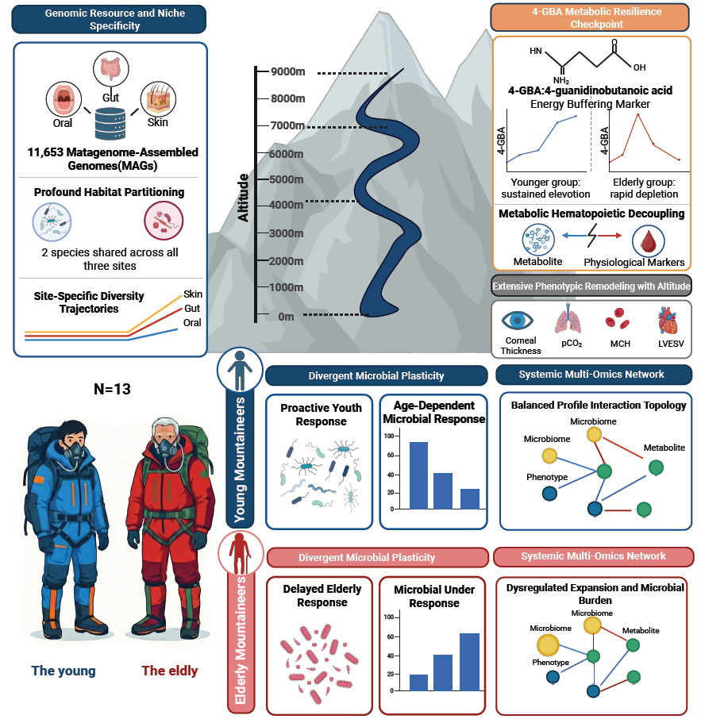

# Qomolangma_MultiOmics
Computational framework and analysis code for the Qomolangma Multi-Omics project

## 📌 Project Overview
<p align="center">
  
</p>
This study provides a high-resolution, longitudinal multi-omics atlas tracking 13 Mount Qomolangma mountaineers across 12 high-density timepoints. The cohort features a strategic generational stratification consisting of a controlled younger cohort (n = 11) serving as a standardized baseline and a rare sub-cohort of elderly individuals over the age of 60 (n = 2) who successfully summited the 8,848.86-meter peak. 

By integrating 348 longitudinal microbiome profiles spanning three distinct mucosal and peripheral body sites (oral, gut, skin) with 89 paired plasma metabolomic and 89 lipidomic profiles, alongside multi-dimensional host physiological remodeling, this project establishes the computational framework to decipher host-microbe co-adaptation under extreme physiological stress.

---

## 📂 Repository Structure

The project directory is structured as follows to ensure computational reproducibility:

```text
Qomolangma_MultiOmics/
├── data/
│   ├── metadata/            # Subject metadata
│   └── processed/           # Processed data
├── results/                 # Figure-specific outputs generated directly
│   ├── fig1/                # Genome-resolved landscape and alpha/beta diversity succession
│   ├── fig2/                # Age plasticity classification indices and tax trajectories
│   ├── fig3/                # Multi-dimensional phenotypic dynamic spectrums
│   ├── fig4/                # Random Forest cross-omics interaction topology networks
│   └── fig5/                # 4-GBA checkpoint directional screening and hematology plots
├── scripts/                 # Core analytical code divided by pipeline stages
│   ├── 01_catalog/          # MAG purification, quality control, and dRep dereplication
│   ├── 02_ecology_analysis/ # Microbial analysis
│   ├── 03_bayesian_model/   # Dynamic Bayesian counterfactual modeling using B-splines
│   ├── 04_difference_analysis/ # Difference_analysis
│   └── 05_multiomics_network/  # Elastic Net feature selection and Random Forest models
└── requirements.txt         # Required Python/R packages and environment dependencies

```

## 🛠️ Pipeline and Script Breakdown

### 01. MAG Catalog Quality Assessment (`scripts/01_catalog/`)
Handles post-binning genomic decontamination and quality evaluation. It runs `MAGpurify` and executes `CheckM (v1.2.2)` via the lineage-specific workflow (`lineage_wf`) specifying input FASTA format. It leverages `dRep` to dereplicate assemblies into non-redundant genome-based species (GBSs) and runs `CoverM (v0.7.0)` to compute baseline relative abundances across longitudinal specimens. 

### 02. Macro-Ecological & Succession Analysis (`scripts/02_ecology_analysis/`)
Processes alpha diversity indices (Shannon tracking) and maps community succession trajectories using Constrained Analysis of Principal Coordinates (CAP) conditioned on individual identities. 

### 03. Dynamic Bayesian Counterfactual Modeling (`scripts/03_bayesian_model/`)
Fits the baseline adaptive trajectory of the youthful cohort (n = 11) using non-linear B-splines to establish a standardized baseline:

$$
y_youth(t) = SUM[ beta_k * B_k(t) ] + epsilon,  where epsilon ~ N(0, sigma^2)
$$


Projects this baseline onto the elderly timepoints to generate counterfactual predictions and quantifies the Age Plasticity Index ($Delta_ij$):

$$
\Delta_{ij} = y_ij_obs - E[ Y_ij_cf | data_youth ]
$$


Categorizes microbes into "young high-active" ($\Delta_{ij} < -0.5$), "elderly high-active" ($\Delta_{ij} > 0.5$), and "age-insensitive" ($|\Delta_{ij}| <= 0.5$) groups.

### 04. Checkpoint Screening & Difference Analysis (`scripts/04_difference_analysis/`)
Identifies time-differential metabolites and clinical readouts. Implements the Strict Directional Consistency Screening module to capture stable, age-specific biological constraints whose deviation polarity remains uniform:
For all 

$$
t_a, t_b in T_sig: sgn( Delta_i,t_a ) == sgn( Delta_i,t_b )
$$

This module successfully isolates 4-guanidinobutanoic acid (4-GBA) as the definitive altitude resilience checkpoint.

### 05. Systemic Multi-Omics Network Integration (`scripts/05_multiomics_network/`)
Integrates the data-driven microbiome-metabolome-phenotype axis. Normalizes taxonomic abundance via centered log-ratio (CLR) transformations and models connections using an Elastic Net regression framework with combined L1 and L2 regularization penalties. Robust features passing 10-fold cross-validation are modeled via a Random Forest regression block to build the topology graphs.

---

## 🛠️ Core Computational Pipelines & Scripts
| Directory | Key Script File | Core Functional |
| :--- | :--- | :--- |
| **03_bayesian_model** | `02_young_Bayesian.py` | Fited non-linear adaptive baselines using B-splines on the standardized younger cohort ($n=11$) to define the baseline "youth phenotype". |
| **03_bayesian_model** | `03_counterfactual_predict.py` | Projected youth-based baselines onto elderly subjects ($n=2$) to establish a Dynamic Bayesian Counterfactual Framework , generating the Age Plasticity Index  |
| **03_bayesian_model** | `04_4-GBA analysis.R` <br> `05_4-GBA and microbiome.R` | Implemented a Strict Directional Consistency Screening filter to isolate stable biomarkers, validating 4-guanidinobutanoic acid (4-GBA) as the definitive altitude resilience checkpoint. |
| **04_difference_analysis** | `01Differential Microbiome Analysis.R` <br> `02_Differential Phenotype Analysis.R` <br> `03_Differential Metabolite Analysis.R`| Conducted temporal differential analysis of microbiome，metabolic and phenotypic profiles |
| **05_multiomics_network** | `01.Elastic_project_KFold10/feature_selection.py main.py`| Executed an Elastic Net regression model merging $L_1$ and $L_2$ regularization penalties alongside 10-fold cross-validation to robustly screen stable features from log-transformed and CLR-transformed multi-omics layers |
| **05_multiomics_network** | `02.RF_using_stable_features/main.py` <br> `03.ElasticNet_using_features`| Incorporated the identified stable multi-omics variables into a random forest ensemble model, and then use Spearman’s correlation analysis to identify the chains of correlations among the microbiome, metabolism, and phenotype. |

## 🚀 Installation & Quick Start

### Prerequisites
Ensure you have Python >= 3.8 and R >= 4.2 installed in your local dual-operating system environment (Windows/Linux).
inux
### Environment Setup
Clone this repository and install all required framework software and computational dependencies defined in `requirements.txt`:

```bash
git clone [https://github.com/HUST-NingKang-Lab/Qomolangma_MultiOmics.git](https://github.com/HUST-NingKang-Lab/Qomolangma_MultiOmics.git)
cd QOMOLANGMA_MULTIOMICS
pip install -r requirements.txt
```


## 📨 Contact

For any inquiries regarding the dynamic Bayesian counterfactual framework, multi-omics network modeling, or data access requests, please reach out to the corresponding authors:
*   **Yuan Wang**
    *   Master student, School of Life Science and Technology, Huazhong University of Science & Technology
    *   📧 Email: wangyuan0807@qq.com
*   **Kang Ning**
    *   Professor, School of Life Science and Technology, Huazhong University of Science & Technology
    *   📧 Email: ningkang@hust.edu.cn
*   **Xiaosen Jiang**
    *   BGI Genomics
    *   📧 Email: jiangxiaosen@genomics.cn
*   **Minfeng Xiao**
    *   BGI Research
    *   📧 Email: xiaominfeng@genomics.cn
